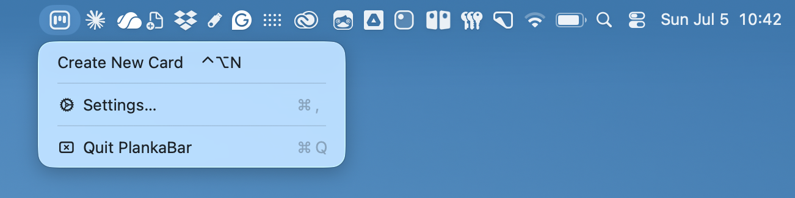
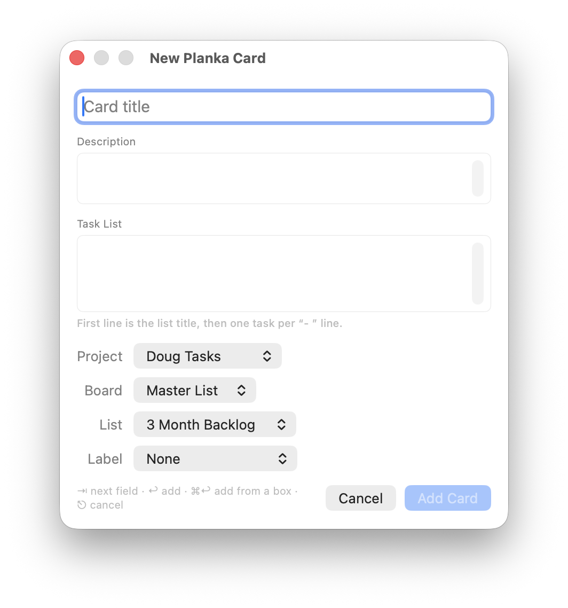
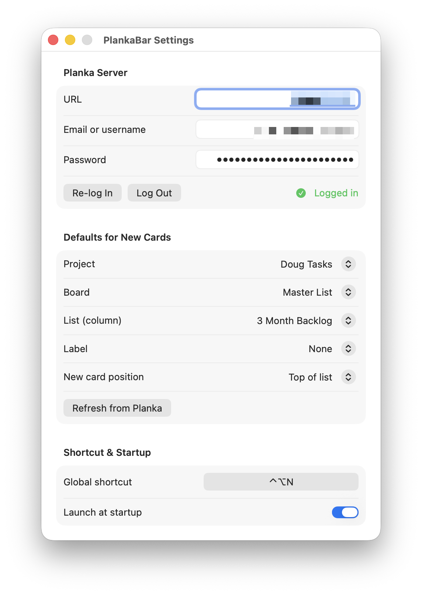

# PlankaBar

A tiny macOS menu bar app for adding cards to a [Planka](https://planka.app)
board — from anywhere, with a global keyboard shortcut.







## Features

- Menu bar icon (stylized kanban board) with **Create New Card**, **Settings…**, **Quit**
- Global shortcut (default **⌃⌥N**, recordable in Settings) — no Accessibility
  permission required
- Spotlight-style popup: type a title, pick Project / Board / List / Label,
  press **Return** to send, **Esc** to cancel
- Username/password login to your Planka server; token and credentials kept in
  the macOS Keychain, with silent re-login when the session expires
- Defaults (project, board, list, label) configurable in Settings, plus a
  choice of whether new cards go to the top (default) or bottom of the list
- Launch at startup toggle
- Success HUD after a card is added; clear inline error messages otherwise
- Functionality to keep entering text as fast as possible without using the mouse.

  - Press Enter while on Card Title to send the card to your Planka instance.
  - Use Tab and Shift+Tab to move between text fields.
  - Press ⌘+Enter when you're in another text field, or tab back to Title and press Enter.
  - Press ESC to exit without creating a card.
  - Use the following simple syntax to create a Task List.

  ```sh
    List Name
    - Item 1
    - Item 2
    - Item 3
  ```

## Requirements

- macOS 14+
- Planka 2.x (partial fallbacks for 1.x but untested)
- Xcode command line tools to build
- NOTE: this was built as a companion app to my [custom fork of Planka](https://github.com/dgaff/planka). However, it should work fine with a standard Planka 2 installation.

## Build

```sh
scripts/build_app.sh
cp -R build/PlankaBar.app /Applications/   # recommended, for launch-at-login
open /Applications/PlankaBar.app
```

The app is ad-hoc (self-)signed by the build script.

## Regenerate icons after a glyph change

```sh
swift scripts/generate_icon.swift /tmp/AppIcon.iconset
iconutil -c icns /tmp/AppIcon.iconset -o Resources/AppIcon.icns
```

## First run

1. The Settings window opens automatically.
2. Enter your Planka URL (e.g. `https://planka.example.com` or `http://localhost:3000`),
   email/username, and password, then **Log In**.
3. Pick your default Project / Board / List (and optionally a Label).
4. Set your shortcut and enable **Launch at startup** if you like.
5. Hit the shortcut anywhere → type a title → **Return**. Done.
